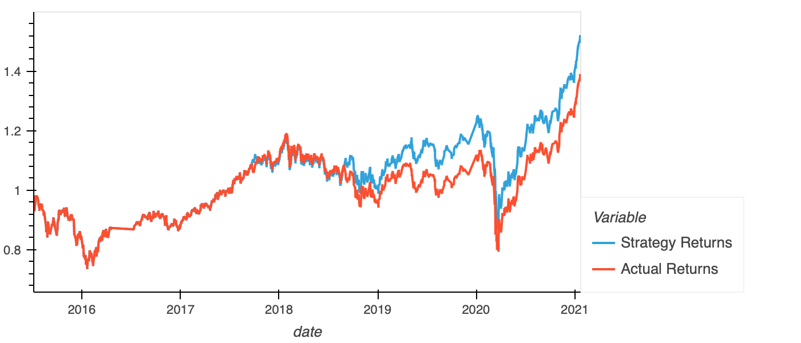
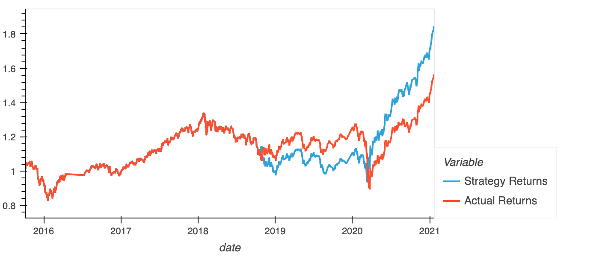
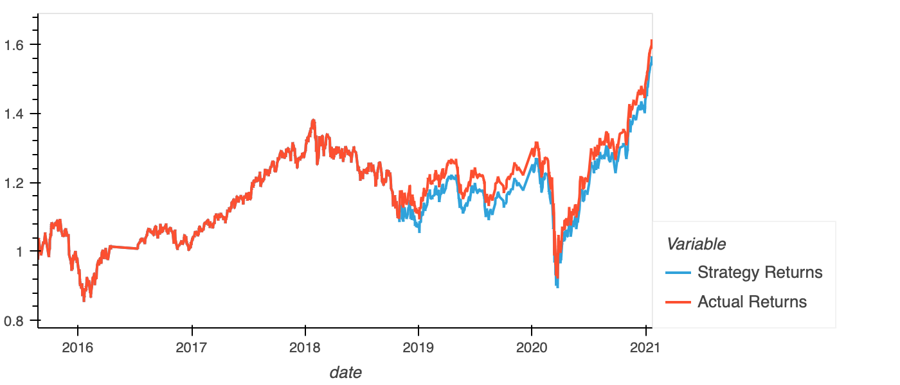
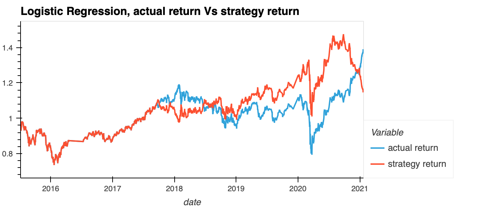

# challenge_14

## 1. Tune the training algorithm by adjusting the size of the training dataset. 

 

### Baseline, training window = 3 months

 
At the 20/01/2021, the actual return was 1.389. The strategy return was 1.520. 

 

### Training window = 30 months 

 
At 20/01/2021, the actual return was 1.563. The strategy return was 1.845. 

 

Increase the training window, had increased the effectiveness of strategy return. This can be seem through the increase in strategy return index from 1.520 to 1.845. 

 

## 2. Tune the trading algorithm by adjusting the SMA input features.
 

### Baseline: short window = 4, long window = 100

 

At the 20/01/2021, the actual return was 1.389. The strategy return was 1.520. 

 

### Short window = 4, Long window = 50. 

 

At 20/01/2021, the actual return was 1.614. The strategy return was 1.565. 

 

After decreasing the long window to 25 days, the difference between strategy return and actual return decreased. This can be seem in the gap between 'strategy return' and 'actual return' line decreased. 

Moreover, the overall return had increased as well. 

 

---

 

## Logsistic Regression Model 
 

Parameters: 
- training window = 3 months
- short window = 4
- long window = 100 
- machine learning model = Logistic Regression. 

 

At 20/01/2021, the strategy return was 1.147. The actual return was 1.389. 

The new model perform worse than the provided model, which was using Support Vector Machine (SVC). This can be viewed through the reverse between the actual return and strategy return from 2021. This can also be seem through the lower return value in comparison with SVC model. 

 

## Conclusion: 

In this project, parameters tuning and varying machine learning model were experimented to improve trading algorithm. 

 

The baseline model and parameters are: 
- model: Support Vector Machine (SVC)
- traning window = 3 months 
- short window = 4 
- long window = 100

Overall, the difference between strategy return and actual return was small between 2015 to 2019. The strategy return had outperformed actual return from 2019. At the 20/01/2021, the actual return was 1.389. The strategy return was 1.520. 

Via tuning the testing parameters, it can be concluded that long training window and shorter long window adds effectiveness to trading algorithm. 

The tested parameters were: 
- model: Support Vector Machine (SVC)
- training window = 6 months 
- short window = 4 
- long window = 50 

The difference between the strategy return and the actual return was small throughout the data's time period. Between 2019 to 2020, the strategy return was slightly below actual return. For baseline, at the 20/01/2021, the actual return was 1.389. The strategy return was 1.520. For adjusted parameter model (as at 20/01/2021), the strategy return was 1.540, the actual return was 1.614. Overall, the parameteres had shown improvement as it had effectively increased the return. 

Logistic Regression was tested instead of Support Vector Machine (SVC). 

At 20/01/2021, the strategy return was 1.147. The actual return was 1.389. There is a inverse relationship between strategy return and actual return from beginning of 2018 to mid 2018. From then, the gap between strategy return and actual return increased. At 2021, the inverse relationship recurred. This suggest Logistic Regression model is less effective to be used in trading algorithm. 

In conclusion, the project recommends using SVC as machine learning model for trading algorithm. The parameters are 6 months trading window for 6 years worth of data. For moving average, short window was 4 days, long window was 50 days. 